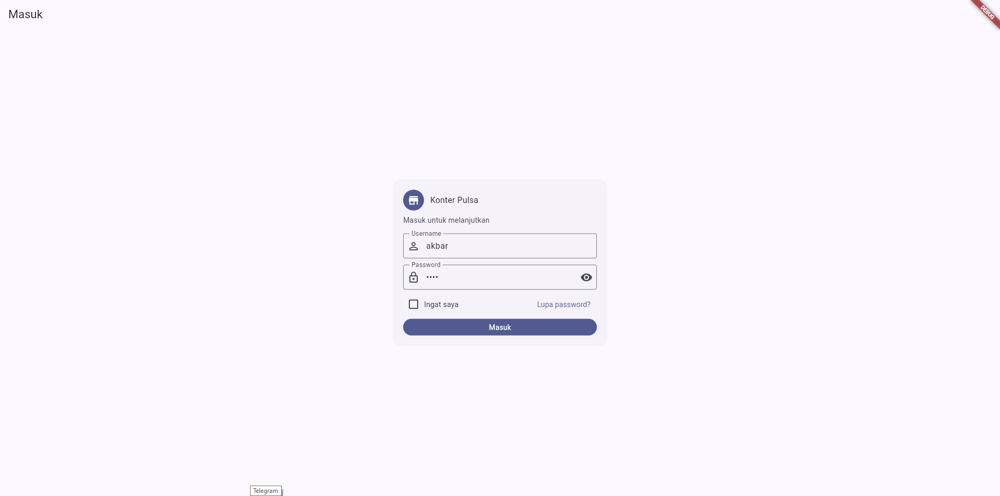
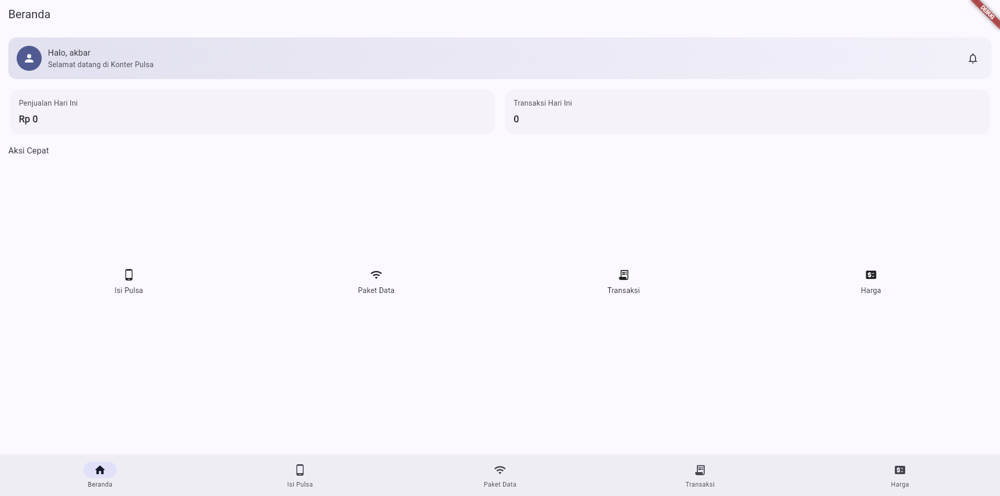
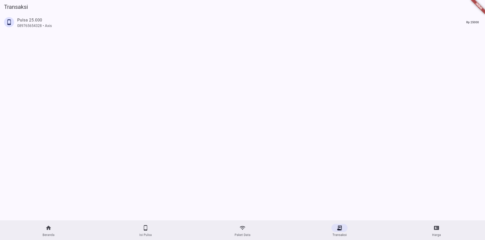
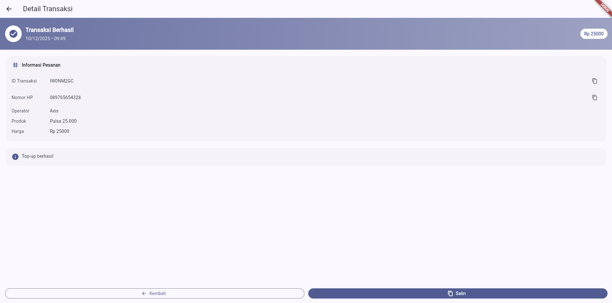

A. Konter Pulsa

B. Deskripsi Singkat
Aplikasi konter pulsa dan data adalah aplikasi yang digunakan untuk melakukan penjualan pulsa reguler dan paket data internet berbagai operator. Aplikasi ini biasanya menyediakan fitur:
Isi ulang pulsa semua operator secara instan.
Pembelian paket data dengan berbagai pilihan kuota.
Riwayat & laporan transaksi untuk memantau penjualan.
Cek harga dan stok saldo secara real-time.
Tujuannya membantu konter melakukan transaksi pulsa dan paket data dengan cepat, mudah, dan akurat.

C. Fitur
1. Fitur Utama
- Isi Ulang Pulsa
- Pembelian Paket Data
2. Fitur Pendukung
- Cek Harga Produk
- Riwayat Transaksi
- Laporan Penjualan
- Manajemen Saldo / Deposit
  
D. Cara Menjalankan
1. Registrasi & Login
Buat akun baru menggunakan nomor HP atau email.
Masuk ke aplikasi dengan akun yang sudah terdaftar.
2. Isi Saldo / Deposit
Lakukan top-up saldo melalui transfer bank, e-wallet, atau metode lain yang disediakan.
Pastikan saldo cukup untuk melakukan transaksi.
3. Pilih Menu Pulsa atau Paket Data
Buka menu Pulsa untuk isi ulang pulsa reguler.
Buka menu Paket Data untuk membeli kuota internet.
4. Masukkan Nomor Pelanggan
Ketik nomor HP pelanggan.
Aplikasi otomatis mendeteksi operator.
5. Pilih Nominal / Paket
Pilih nominal pulsa atau jenis paket data yang diinginkan.
Cek harga dan masa aktif jika diperlukan.
6. Konfirmasi & Bayar
Tekan tombol Beli / Kirim.
Transaksi akan diproses menggunakan saldo deposit.
7. Cek Status Transaksi
Lihat status di halaman Riwayat Transaksi untuk memastikan berhasil.

E. Screenshot Halaman Utama

